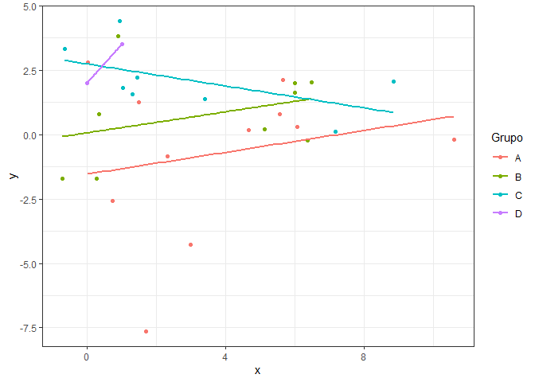
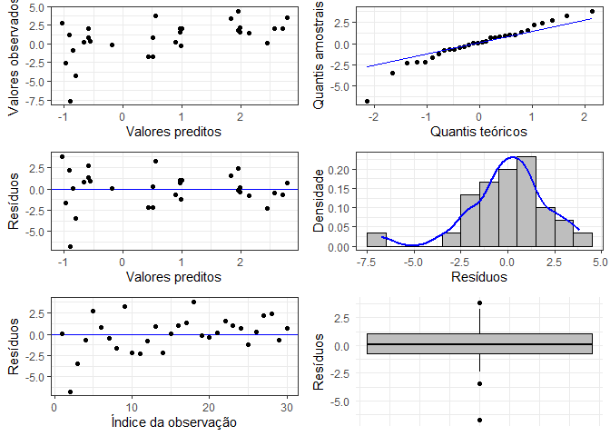

# API-Regressao

Este repositório contém uma API com funções relacionadas à regressão
linear e um banco de dados para ser usado nesse contexto.

Além das variáveis `id` e `momento_registro`, que se referem,
respectivamente, ao id da observação e ao dia e horário em que ela foi
registrada, o conjunto de dados contém outras três colunas: uma
correspondente à variável resposta `y` e duas referentes às covariáveis
`x` e `grupo`. As variáveis `y` e `x` são variáveis numéricas contínuas
e `grupo` é uma variável qualitativa categórica que assume, a princípio,
três valores: `A`, `B` e `C`.

As rotas disponíveis na API estão descritas abaixo, acompanhadas de
exemplos de como realizar uma requisição para cada uma delas.

## Rota para inserir um novo dado

Para inserir um novo dado é necessário acessar a rota `/insereDado`,
clicar em “Try it out” e preencher os campos das variáveis `x`, `y` e
`grupo` com os valores desejados, considerando que `x` e `y` devem ser
um número e `grupo` deve ser uma letra. Após clicar em “Execute”, a API
deve retornar o banco de dados atualizado com a nova observação, assim
como o seu id, a data e o horário em que a informação foi inserida.

Por exemplo, se os campos forem preenchidos tal que `x = 1`, `y = 2` e
`grupo = A`, a API deve retornar algo semelhante a isso:

\[{banco antigo},{“id”: 31,“x”: 1,“grupo”: “A”,“y”:
2,“momento_registro”: “2024-10-18T17:47:06Z”}\]

Só é possível inserir uma nova observação por vez. Além disso, um grupo
que não existe previamente no conjunto de dados pode ser incluído caso
seja de interesse.

## Rota para excluir um dado

Para excluir um dado, é necessário acessar a rota `/excluiDado`, clicar
em “Try it out” e preencher o campo com o id da linha que se deseja
excluir. Este id é referente à identificação da observação, não
necessariamente corresponde ao número da linha no qual o dado aparece no
conjunto de dados. Após clicar em “Execute”, a API retornará o banco de
dados atualizado, sem a observação que foi excluída. Só é possível
excluir uma observação por vez.

## Rota para calcular os parâmetros da regressão

Os parâmetros da regressão linear são calculados a partir do banco de
dados já atualizado, caso um novo dado tenha sido inserido. Por isso é
necessário apenas acessar a rota `/parametros`, clicar em “Try it out” e
em seguida em “Execute”. A API deve retornar uma lista no formato JSON
com valores correspondentes aos parâmetros presentes na regressão.

Por exemplo, ao calcular os parâmetros do modelo de regressão ajustado
com o banco de dados contido neste repositório, a API retornará o
seguinte resultado:

\[ { “nome”: “(Intercept)”, “valor”: -1.0332 }, { “nome”: “x”, “valor”:
0.0793 }, { “nome”: “grupoB”, “valor”: 1.5209 }, { “nome”: “grupoC”,
“valor”: 2.9136 }, { “nome”: “grupoD”, “valor”: 3.7435 }, { “nome”:
“sigma”, “valor”: 2.2833 }\]

## Rota para calcular a signficância dos coeficientes da regressão

Para calcular a signficância estatística dos coeficientes da regressão é
necessário acessar a rota `/significancia`, clicar em “Try it out” e em
seguida em “Execute”. A API deve retornar, no formato JSON, o p-valor
associado a cada parâmetro e se ele é ou não significativo. Por default
o nível de significância utilizado é 0.05, mas outros níveis de
significância podem ser usados alterando o campo `sig`.

Por exemplo, ao calcular o p-valor associado aos coeficientes do modelo
de regressão ajustado com o banco de dados contido neste repositório e
verificar se eles são significativos a um nível de significância de
`0.05`, a API deve retornar o seguinte resultado:

\[ { “nome”: “(Intercept)”, “pvalor”: 0.2513, “significativo”: “não” },
{ “nome”: “x”, “pvalor”: 0.5867, “significativo”: “não” }, { “nome”:
“grupoB”, “pvalor”: 0.1514, “significativo”: “não” }, { “nome”:
“grupoC”, “pvalor”: 0.0115, “significativo”: “sim” }, { “nome”:
“grupoD”, “pvalor”: 0.0501, “significativo”: “não” }\]

## Rota para calcular os resíduos da regressão

Para calcular os resíduos da regressão é necessário acessar a rota
`/residuos`, clicar em “Try it out” e em seguida em “Execute”. A API
deve retornar o resultado no formato JSON.

Por exemplo, ao calcular os resíduos do modelo de regressão ajustado com
o banco de dados contido neste repositório, a API retornará o seguinte
resultado:

\[ 0.0056, -6.7284, -3.4673, -0.6768, 2.6924, 0.8433, -0.5094, -1.599,
3.2508, -2.219, -2.3413, -0.7619, 0.8613, -2.1494, 0.0144, 1.0396,
1.3905, 3.8229, -0.1431, -0.4189, 0.2171, 1.5133, 1.0335, 0.6551,
-1.2194, 0.2856, 2.1642, 2.4442, -0.7103, 0.7103\]

## Rota para calcular os valores preditos para as observações do banco de dados

Para calcular os valores preditos da para as observações do banco de
dados é necessário acessar a rota `/preditos`, clicar em “Try it out” e
em seguida em “Execute”. A API deve retornar o resultado no formato
JSON.

Por exemplo, ao calcular os valores preditos para o modelo de regressão
ajustado com o banco de dados contido neste repositório, a API retornará
o seguinte resultado:

\[ -0.1916, -0.8979, -0.7968, 0.8943, -0.5851, -0.6628, 2.5832, -0.9753,
0.5592, 0.5089, 2.4496, 2.1509, -0.552, 0.4303, -0.8487, 1.0029,
-0.5918, -1.0307, 1.9625, 1.984, 1.9956, 1.8289, 0.9633, 0.9644, 0.9926,
0.5144, -0.9142, 1.9558, 2.7103, 2.7897\]

## Rota para calcular a predição para novos valores

Para realizar uma ou mais predições para novos valores primeiramente é
necessário definir (em uma outra sessão do RStudio, por exemplo) um
banco de dados com essas novas observações, como a seguir:

``` r
body = data.frame(x = c(3,4), grupo = c("A", "B"))
body
#>   x grupo
#> 1 3     A
#> 2 4     B
```

Veja que as colunas do banco de dados devem ser nomeadas com os mesmos
nomes das covariáveis usadas para calcular o modelo de regressão, isto
é, `x` e `grupo`.

Após executar a API (e mantê-la aberta), basta executar o seguinte
comando:

``` r
library(httr2)
request("http://127.0.0.1:7593/predicao") |>
 req_method("GET") |>
 req_body_json(data=body, auto_unbox = TRUE) |>
 req_perform() |>
 resp_body_string()
```

O resultado deve ser um JSON com a(s) predição(ões) para os novos
valores. Para o exemplo acima, a API deve retornar:

“\[-0.7952,0.805\]”

## Rota para obter um gráfico de dispersão com as retas de regressão ajustadas

Para gerar um gráfico de pontos com a reta de regressão ajustada para
cada variável categórica presente no banco é necessário acessar a rota
`/grafico`, clicar em “Try it out” e em “Execute”. A API deve retornar
um gráfico com os dados e as retas coloridas de acordo com os grupos aos
quais pertencem, além da legenda das cores correspondentes a cada grupo.

Por exemplo, ao gerar o gráfico a partir do banco de dados contido neste
respositório, a API retornará a seguinte imagem:

<!-- -->

## Rota para obter gráficos de resíduos

Para obter os gráficos de resíduos é necessário acessar a rota
`/graficosResiduos`, clicar em “Try it out” e em “Execute”. A API deve
retornar uma imagem com seis gráficos:

- Valores predidos x Valores observados;
- QQplot dos resíduos;
- Valores preditos x Resíduos;
- Histograma dos resíduos;
- Número da observação x Resíduos; e
- Boxplot dos resíduos.

Por exemplo, ao gerar os gráficos de resíduos a partir do banco de dados
contido neste respositório, a API retornará a seguinte imagem:

<!-- -->
